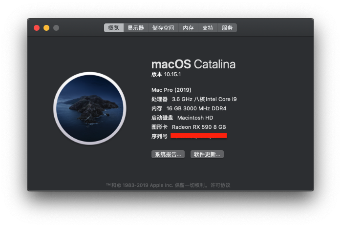

# Clover EFI + 我的配置

## 完美程度:

* **板载声卡:** 正常
* **板载网卡:** 正常
* **睡眠/关机:** 正常
* **AirPlay Mirror:** 正常
* **iCloud:** 正常
* **GPU 硬解:** 无核显硬解加速, 独立显卡 GPU 负荷正常
* **USB:** 外置硬盘, 打印机均正常
* **NTFS 读写:** 配合 Tuxera NTFS 可以正常挂载读写
* **虚拟机支持:** PD 14 运行 Windows 10 正常
* **稳定性:** Final Cut Pro, After Effects 偶现 GPU 驱动的 crash, 暂无五国, 黑屏等问题

## 主机配置:

* **主板:** GIGABYTE (技嘉) B360M DS3H
* **处理器:** Intel i7 9700KF
* **闪存:** Corsair (海盗船) 单条 16 GB, DDR4 3000 MHz
* **显卡:** 蓝宝石 AMD Radeon RX590, 8 GB 闪存
* **固态硬盘:** Western Digital (西部数据) 黑盘 NVMe 250 GB
* **机械硬盘:** Seagate (希捷) 1 TB, 7200 转 **x2**

## 系统版本:
macOS Catalina 10.15.1 (19B88)

## 安装盘制作方式:
准备 16 GB 的 U 盘, 从 Mac App Store 下载 `安装macOS Catalina.app` 并使用其内置的 `createinstallmedia` 命令行工具创建启动盘. 下载 `Clover Configurator.app` 并安装最新版本的 Clover EFI.

## 重点配置内容及说明:

### ACPI 补丁

* **`SSDT-EC.aml`:** 不添加引导过程会出现"禁行符号"

### Kexts

* **`RealtekRTL8111.kext`:** 板载网卡驱动, 如果已经自行安装完美白苹果网卡可删除该驱动
* **`FakeSMC.kext`:** 可使用 `VirtualSMC` 代替, 未验证

### 其他补丁

* **内核和驱动补丁:** 开启 `内核电源` 和 `Apple RTC` 选项, 否则卡加号无法引导

## 运行截图:

